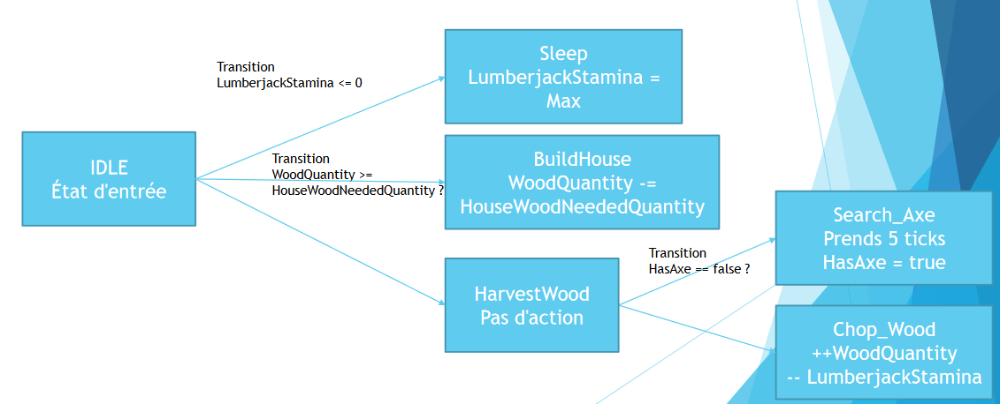

# TD - State Machine

## Instruction

- Il est obligatoire de prendre un langage orienté objet, mais vous pouvez choisir celui que vous voulez
- Il est interdit d'utiliser des bibliothèques non natives au langage
- Selon le langage que vous prenez, il faut bien faire attention aux performances / allocation mémoire
- Attention, la state machine a réalisé est dans un premier temps imposé

## Objectif

**Données du monde :**

- WoodQuantity: X
- HouseWoodNeededQuantity: Y
- HasAxe: boolean
- LumberjackStamina: Z

On reprend l'exemple du bucheron qui doit construire sa maison

**Réalisez la state machine suivante :**

## Explications

- Un tick= 1 process de la statemachine
- À chaque action réalisée, le bucheron perd de l'énergie (lumberjackStamina)
- **Attention :** l'ordre des transitions à de l'importance et doit être traité dans le bon sens (dans l'exemple de haut vers le bas).

## La classe WorldParameter / WorldConstante

- Cette classe contiendra simplement les données du monde comme modélisé dans l'exemple ci-dessus :
  - **WoodQuantity**: quantité de bois en possession du bucheron
  - **HasAxe**: le bucheron possède-t-il une hache
  - **LumberjackStamina**: énergie du bucheron
- Cette classe contiendra simplement les données constantes du monde :
  - **HouseWoodNeededQuantity**: Quantité de bois nécessaire à la construction d'une maison
  - **LumberjackStaminaMaximum**: énergie max du bucheron

## La classe Transition

- Réalisez une classe mère appelée Transition
- Cette classe contiendra :
  - Une fonction "bool **isTransitionValid**"

## L'enum ActionState

- Enumde trois valeurs
  - **None**
  - **Running**
  - **Finished**

## La classe mère State

- Réalisez une classe mère appelée State
- Cette classe contiendra :
  - Un **ID**
  - Un **ActionState**(enum)
  - Une fonction "void **ExecuteAction**"

## La classe StateMachine

- Réalisez une classe appelée StateMachine
- Cette classe contiendra :
  - Une fonction "**voidProcess**" : à chaque appel, regarde l'état courant, réalise l'action, sinon, trouve la nouvelle action
  - Une liste de pair : State → Pair(Transition, State) correspondant à l'état de départ, et la transition pour un état d'arrivé
  - Une fonction "**InitializeStateMachine**" : qui servira a créer la state machine décrite ci-dessus
  - Une fonction "**DeinitStateMachine**" : qui servira à détruire la state machine

## Les classes State spécifiques au projet

- Il faut maintenant réaliser les classes d'état décrites dans la state machine

  - Ces classes héritent toutes de la classe mère State

- **State_IDLE**: DoNothing

- **State_Sleep**: LumberjackStamian remit au maximum

- **State_HarvestWood**: DoNothing

- **State_SearchAxe**: Après 5 tick HasAxe= true

- **State_ChopWood**: Chaque tick WoodQuantity +1 (Attention, à chaque tickl'action se termine complètement !)

- State_BuildHouse

  :

  - Construis une maison;
  - WoodQuantity -= HouseWoodNeededQuantity;
  - LumberjackStamina= 0;

## Les classes transition spécifique au projet

- Il faut maintenant réaliser les classes de transition décrite dans la state machine
  - Ces classes héritent toutes de la classe mère Transition
- **Transition_IsTired**: LumberjackStamina<= 0
- **Transition_CanBuildHouse**: WoodQuantity>= HouseWoodNeededQuantity
- **Transition_HasAxe**: HasAxe== True

## Réaliser la StateMachine spécifique

- Dans la fonction **InitializeStateMachine** réalisez les associations State Transition décrites dans l'image.
- Dans la fonction **DeInitializeStateMachine** détruire les objets selon le langage utilisé

## Questions de cours

- Avez utilisé l'ID du StateMachine?
  - Sinon, proposez une utilisation possible pour optimiser le traitement.
- Expliquez la principale utilité de passer par un GOAP plutôt qu'un state Machine
- Donnez des exemples d'utilisation où le StateMachine est le plus performant
